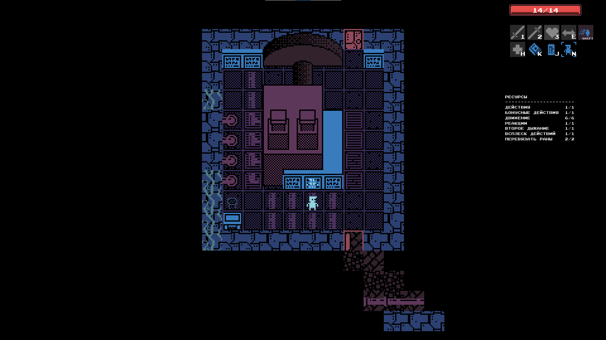

# Fallen



RPG/adventure demo written in Lua with LOVE2D.

- [Download](https://github.com/girvel/fallen/releases/latest) (alpha)
- [Documentation](/docs/README.md) (in progress)
- [Prototype](https://github.com/girvel/fallen_python)
- [VK (RU)](https://vk.com/st_celest)
- [Telegram (RU)](https://t.me/stcelest)

## Launching from source

Can be launched from the Fallen's root folder using [LOVE](https://love2d.org/):

```bash
love .
```

