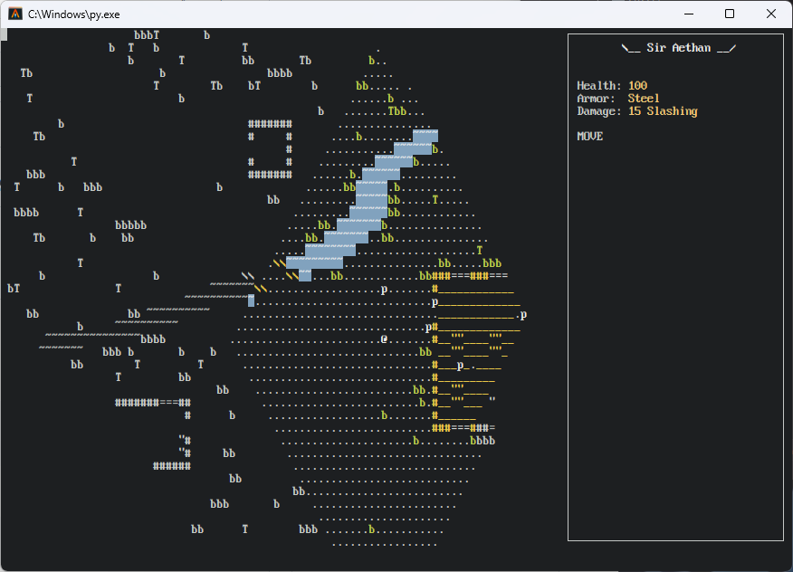

[English](/README.md) Русский

# Fallen: реактивная мини-РПГ

Всегда хотел запилить свою ролевую компьютерную игру, и вот получилось.



## Установка

(Примеры команд приведены для Windows, пользователи линукса точно знают как запускать скрипт на питоне)

1. Установить [Питон 3.10](https://www.python.org/downloads/release/python-31011/) (работает только на 3.10)
2. Скачать [последний релиз](https://github.com/girvel/fallen/releases/latest) - файл `Source code (zip)`
3. Распаковать архив
4. Открыть терминал и перейти в папку игры:

Переключиться на диск, на который была распакована игра (для меня это диск D)

```commandline
D:
```

Перейти в распакованную папку с игрой -- в ней должен быть файл `fallen.py` (для меня D:\Downloads\fallen-0.1.0):

```commandline
cd D:\Downloads\fallen-0.1.0
```

5. Установить зависимости:

```commandline
py.exe -3.10 -m pip install -r requirements.txt
```

6. Запустить игру:

```commandline
py.exe -3.10 fallen.py
```

Чтобы запустить игру снова повторить шаги 4 и 6.

# Для разработчиков

## Установка для разработки

1. Установить [Гит](https://git-scm.com/) и [Питон 3.10](https://www.python.org/downloads/release/python-31011/) (работает только на 3.10)
2. Открыть терминал и переместиться в папку, куда будет установлена игра
3. Клонировать репозиторий с игрой

```bash
git clone https://github.com/girvel/fallen
cd fallen
```

4. Установить зависимости:

```shell
pip install -r requirements.txt
```

5. Запустить игру:

```shell
python fallen.py
```

## Документация

См. `docs/` (на английском)

## Makefile

По сути контейнер для скриптов разработки. `make` чтобы запустить игру, `make debug` чтобы запустить игру в режиме отладки, `make profile` чтобы запустить профайлер, `make line_profile` чтобы запустить построчный профайлер.

# Авторы и участники

- Создатель: [Никита Добрынин / girvel](https://github.com/girvel)
- Тестирование/геймдизайн: [Alexlosos](https://github.com/potekhinavas)
